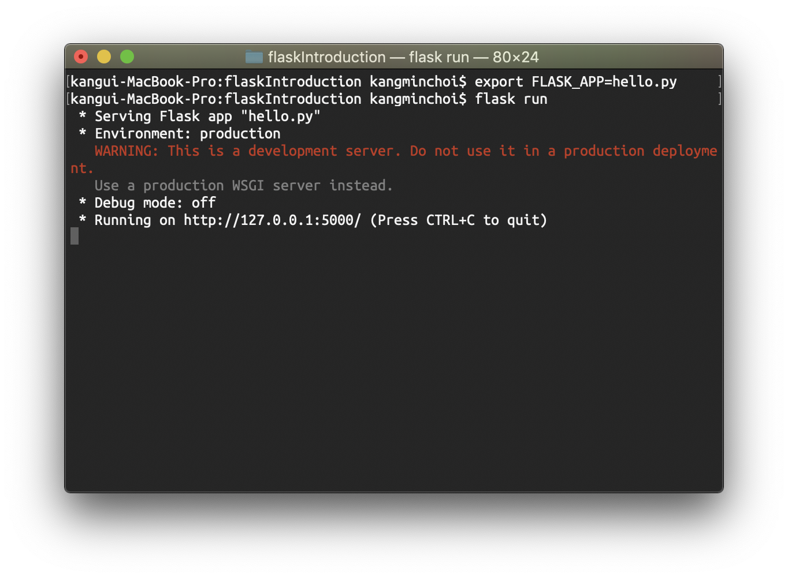
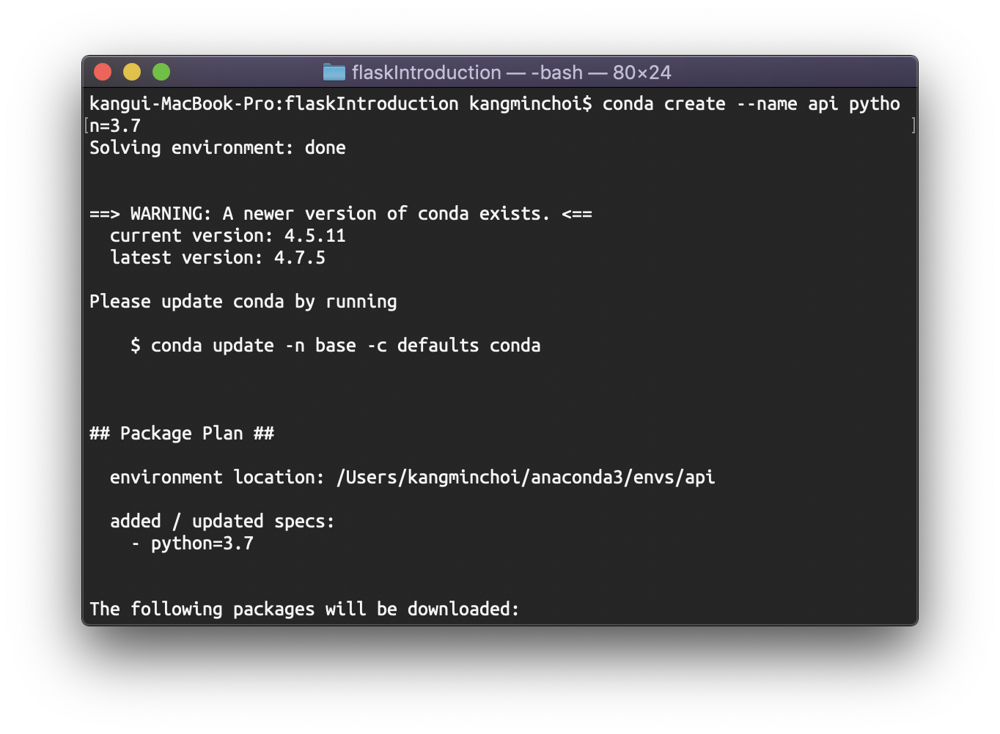
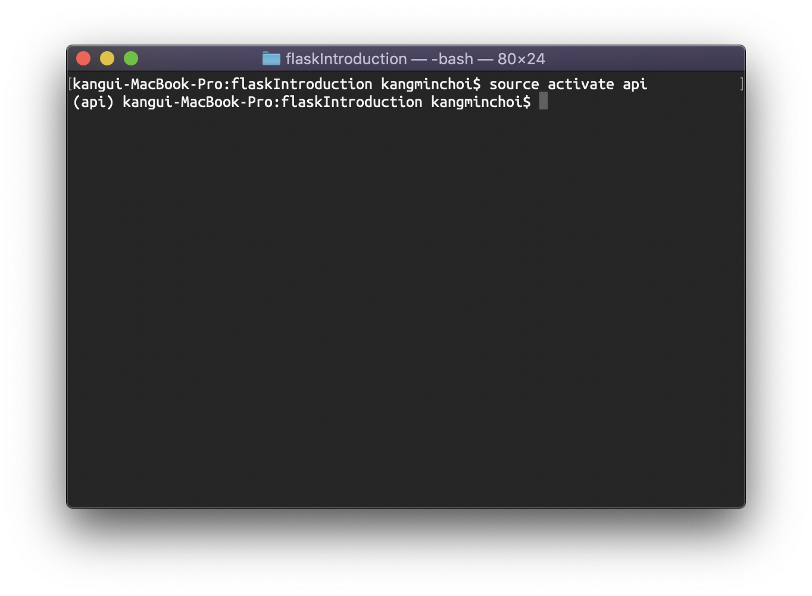
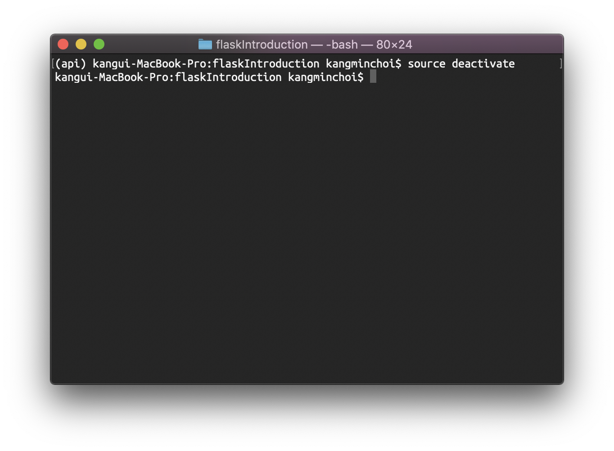
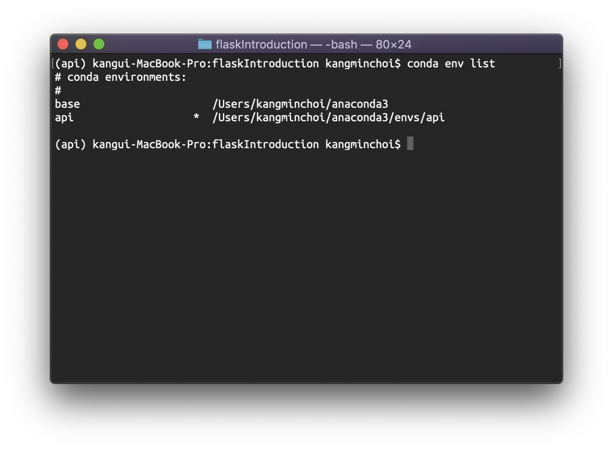

# `Flask`란?
> The Python micro framework for building web applications  
> 파이썬을 활용해 웹 어플리케이션을 구현하는 마이크로 프레임워크  
> 군더더기 없는 아주 가벼운 프레임워크  
> ~필요한 기능을 내가 만들죠~  

## 참고 `Reference`
* [Flask 공식 홈페이지](https://flask.palletsprojects.com/en/1.1.x/)
* [Flask 깃헙](https://github.com/pallets/flask)


# `Flask`로 나만의 웹페이지 만들기
프로젝트 폴더에 `hello.py` 파일을 만들고 아래의 코드을 복사해 붙여넣습니다.  
`hello.py`  
```python
from flask import Flask
app = Flask(__name__)

@app.route('/')
def hello_world():
    return 'Hello, World!'
```
웹 서버를 키고 [http://127.0.0.1:5000/](http://127.0.0.1:5000/)로 들어가면 아래의 웹페이지를 볼 수 있습니다.  

`bash` 창에 웹서버를 실행하는 명령어를 입력합니다
```console
$ export FLASK_APP=hello.py
$ flask run
```


현재 `Debug mode`가 off입니다.  
`Debug mode`를 켜주면 코드가 바뀔 때마다 서버가 다시 로드됩니다.  
개발하며 수정하면 바로 적용되어 굉장히 편합니다.  
```console
$ export FLASK_ENV=development
$ flask run
```


## 파이썬 가상환경
> 필요하신 분들만 하시면 됩니다
### 가상환경 생성하기
```console
$ conda create --name api python=3.7
```

### 가상환경 활성화
```console
$ source activate api
```

### 가상환경 비활성화
```console
$ source deactivate
```

### 가상환경 리스트 확인
```console
$ conda env list
```


